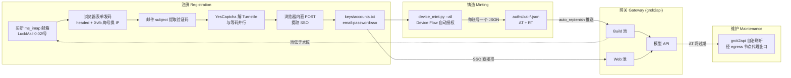

# grok-register

**x.ai (Grok) 账号自动注册 / OAuth 铸造 / 池补位一体化工具箱**
*Automated account registration, OAuth token minting and pool auto-replenish toolkit for x.ai (Grok).*

---

## 这是什么 / What is this?

全自动批量生产 x.ai (Grok) 账号并接入 [grok2api](https://github.com/chenyme/grok2api) API 网关的工具箱,四个环节:

1. **注册** — 自动购买邮箱、过 Cloudflare 人机验证(Turnstile)、在 accounts.x.ai 注册新账号,拿到 **SSO 凭证**
2. **铸造 (mint)** — 把 SSO 凭证通过 OAuth **Device Flow** 兑换成长期有效的 **Access/Refresh Token**(浏览器自动授权,全程无人值守)
3. **补位** — 常驻守护进程监控账号池,数量不足自动注册新号并推送到 grok2api
4. **保鲜** — 定时刷新 Access Token(职责单一归属 grok2api,见[Token 保鲜](#token-保鲜--重授权重要))

### 核心术语 / Glossary

| 术语 | 含义 |
|---|---|
| **SSO 凭证** | 注册成功后 x.ai 下发的会话凭证(一段长字符串),证明账号已登录。保存在 `keys/accounts.txt` |
| **铸造 (mint)** | 用 SSO 去 OAuth 授权服务器换正式 Token 的过程 |
| **Device Flow** | OAuth 2.0 设备授权流:本工具用浏览器自动化自动完成授权 |
| **Access Token (AT)** | 调用 API 的短期凭证(约 6 小时),见 `auths/*.json` |
| **Refresh Token (RT)** | 长期凭证,AT 过期后用它换新 AT;x.ai 每次刷新会**轮换 RT**(旧 RT 立即作废) |
| **Build 池 / Web 池** | grok2api 的两类账号池:Build = 铸造后的 OAuth Token;Web = SSO 直接可用 |
| **Turnstile / YesCaptcha** | Cloudflare 人机验证组件 / 第三方打码平台(API 自动解 Turnstile) |
| **CF = Cloudflare** | 全球 CDN/WAF。**拦截数据中心 IP 与 headless 浏览器**,是本工具最大的外部障碍 |
| **xvfb** | 虚拟显示器:让"有头"浏览器跑在无显示器的服务器上 |
| **mihomo / Clash** | 代理客户端,提供干净出口 IP(绕过 CF 对数据中心 IP 的拦截) |

---

## 工作流程 / How it works



一句话:**注册得 SSO → 铸造得 OAuth Token → 推进 grok2api → 池子低了再注册**。注册/铸造走浏览器(有头),Token 刷新走 API(单归属 grok2api)。

### 职责划分 / Responsibility split

| 环节 | 归属 | 说明 |
|---|---|---|
| 注册 / 铸造 / 推送 | **grok-register** | 浏览器完成:SSO → OAuth Token → 喂池 |
| 水位判定 + 补位 | **grok-register** | 池低于水位自动注册/铸造/推送(`auto_replenish --daemon`) |
| IP 轮换 | **grok-register** | 注册/铸造前切换干净出口(`clash_rotator`) |
| 余额监控 / 告警 | **grok-register** | 阈值停补水 + Telegram/SMTP(`balance_monitor`) |
| RT 撤销重授权 | **grok-register** | SSO → Device Flow 重铸 → 推回(`reauth_batch --daemon`,自动) |
| AT 刷新 + RT 轮换 | **grok2api** | 自治调度,**执行权唯一归属**——本地双刷会互相作废 RT(见 [Token 保鲜](#token-保鲜--重授权重要)) |
| 推理 / 对话 API | **grok2api** | 账号池服务端 |
| 配额同步 / 账号状态 | **grok2api** | 标记 disabled / reauthRequired |
| 质量守卫 | **grok2api**(+sidecar) | 节点健康 + 降智隔离(见[推荐配套](#推荐配套--recommended-companions)) |

> 关键边界:刷新是"触发权在 grok-register(`--refresh-only` 只是调 grok2api 的刷新 API)、**执行权唯一在 grok2api**"。grok-register 是"造号端",grok2api 是"服务端",两者通过管理 API + SQLite 协作。

---

## 特性 / Features

- **免费注册主通道** (`grok_free.py`) — 买断 ms_imap 邮箱 + 浏览器表单发码 + 邮件提码 + YesCaptcha 解 Turnstile + 浏览器内直 POST。成本约 $0.024/号,35s–2min/号
- **自动注册备用引擎** (`grok.py`) — YesCaptcha 付费路径(依赖 x.ai 端到端开放,失效时以 grok_free 为主)
- **SSO → OAuth 铸造** (`device_mint.py`) — Device Flow 自动授权,多轮失败重试,无显示器自动起 Xvfb
- **自动补位守护** (`auto_replenish.py`) — 双水位(付费保底/免费路径),每号轮换出口 IP,连续失败提前止损 + 零增长熔断休眠
- **IP 轮换** (`clash_rotator.py`) — 注册前切换代理节点(LRU 避用近期节点),`GROK_SKIP_NODES` 黑名单
- **Token 重铸** (`reauth_batch.py` / `remint_oauth.py`) — RT 被 x.ai 撤销后,用 SSO 重新铸造并推回网关
- **余额监控** (`balance_monitor.py`) — LuckMail/YesCaptcha 余额低于阈值 → 停补水 + 邮件/Telegram 告警 + 日志健康分析
- **多邮箱商** — GPTMail / mail.tm / LuckMail(买断/接码)/ MailNest / Gmail,API 统一,可逗号组成回退链

---

## 文件结构 / Project layout

```
grok-register/
├── grok_free.py          # 注册引擎(主通道:表单发码 + YesCaptcha)
├── grok.py               # 注册引擎(付费备用路径)
├── device_mint.py        # SSO → OAuth Token 铸造(核心)
├── auto_replenish.py     # 补位守护 + 池管理(双水位/轮换IP/止损/推送)
├── balance_monitor.py    # 余额监控(阈值停补水 + 告警 + 日志分析)
├── status.py             # 状态总览(池水位/注册/铸造/刷新/API 成功率/服务,支持 --json)
├── tg_bot.py             # Telegram 查询机器人(发命令/关键词即回状态)
├── reauth_batch.py       # 批量重铸:grok2api 中 reauthRequired 账号自动重授权(推荐)
├── remint_oauth.py       # 一次性重铸(手选少量账号;按需改顶部 NEED 数组)
├── clash_rotator.py      # 代理节点轮换(LRU)
├── email_service.py      # 邮箱商统一封装
├── YesCaptcha_service.py # Turnstile 求解封装
├── xai_oauth.py          # OAuth 公共常量(CLIENT_ID 集中定义)
├── auth_store.py         # OAuth token 存档读写
├── luckmail/             # 内置 LuckMail SDK
├── keys/                 # 注册输出(运行时生成,已 gitignore)
│   ├── accounts.txt      #   email:password:sso(每行一个)
│   └── grok.txt          #   纯 SSO 列表
├── auths/                # 铸造输出(运行时生成,已 gitignore):每账号一个 xai-<email>.json
├── deploy/               # systemd 服务模板(本机用户级 + VPS 级)
├── .env.example          # 全部配置模板(复制为 .env)
└── pyproject.toml        # 依赖与项目元数据
```

---

## 快速开始 / Quick Start

> 写给人类和 AI 代理:每一步都有**完成判据**——做完对照检查,不满足就别往下走。
> 给 AI 的部署指令可以逐条执行本清单,每个判据都是可验证的命令输出。

### 前置条件 / Prerequisites

| 项 | 要求 | 自检命令(期望输出) |
|---|---|---|
| Python | ≥ 3.10 | `python3 --version` → `Python 3.10+` |
| 包管理器 | [uv](https://docs.astral.sh/uv/)(或 pip) | `uv --version` → `uv x.y.z` |
| 浏览器 | 系统 Chrome/Chromium(铸造必需;无则自动降级,CF 拦截率上升) | `google-chrome --version` 或 `chromium --version` |
| 代理 | 任一 Clash/mihomo 实例,含干净节点(见[实战要点](#实战要点踩坑记录)) | 见 Step 3 |
| 账号 | YesCaptcha key(注册用);LuckMail/MailNest key(按邮箱商) | 见 Step 2 |

### Step 1 — 安装依赖

```bash
git clone https://github.com/wwwhynot3/grok-register.git
cd grok-register
uv sync            # 或: pip install -r <(uv export --format requirements-txt)
```

**完成判据**:`uv run python -c "import curl_cffi, patchright"` 无报错。

### Step 2 — 配置

```bash
cp .env.example .env
# 编辑 .env,必填三件套:
#   YESCAPTCHA_KEY=        # https://yescaptcha.com 获取
#   EMAIL_PROVIDER + LUCKMAIL_API_KEY 或 MAILNEST_API_KEY   # 邮箱商
#   GROK_PROXY=            # 指向你的 Clash/mihomo 混合端口
```

**完成判据**:`.env` 里三组值都已填且非空。(完整键清单见 `.env.example` 注释,每个键都有获取方式说明。)

### Step 3 — 验证代理链路

```bash
curl -s -o /dev/null -w "%{http_code}" -x "$GROK_PROXY" https://accounts.x.ai/sign-up
```

**完成判据**:输出 `200`。403 = CF 拦截,先解决代理/节点再继续(见[故障排查](#故障排查--troubleshooting))。

### Step 4 — 注册 1 个账号(验证全链路)

```bash
uv run python grok_free.py --count 1
```

**完成判据**:`keys/accounts.txt` 末尾新增一行 `email:password:sso`。失败先看是否 CF 拦截或验证码未达(邮箱商问题),不要盲目重试烧邮箱配额。

### Step 5 — 铸造 OAuth Token

```bash
uv run python device_mint.py --all
# 首次需装浏览器自动化内核:
uv pip install patchright && uv run python -m patchright install chromium
```

**完成判据**:`auths/` 下出现 `xai-<email>.json`,内含 `access_token` 与 `refresh_token`。已铸造的账号会自动跳过。

### Step 6 — 验证账号互相独立(重要,防止整池塌成一个用户)

```bash
uv run python -c "
import json, glob, base64
subs=[]
for f in glob.glob('auths/*.json'):
    p=json.load(open(f))['access_token'].split('.')[1]; p+='='*(-len(p)%4)
    subs.append(json.loads(base64.urlsafe_b64decode(p)).get('sub'))
print(len(subs), 'tokens,', len(set(subs)), 'unique users')"
```

**完成判据**:`unique users` == `tokens`。若为 1,说明有人手动"帮忙"授权过,删 `auths/` 重新 `--all` 铸造(见[实战要点](#实战要点踩坑记录) #3)。

### Step 7 — 推送到 grok2api(如有网关)

```bash
uv run python auto_replenish.py --push-existing
```

**完成判据**:输出显示 Build/Web 池账号数增加,且管理端账号状态为 `active`。默认跳过池中已有账号(防止旧 token 覆盖新 token);`--force` 强制覆盖(重铸后同步用)。

### Step 8 — 常驻补位守护(可选)

```bash
uv run python auto_replenish.py --daemon 600    # 每 600s 检查一次
```

**完成判据**:日志周期性输出 `Build池: N | Web池: M`;池满时休眠零消耗,低于水位自动注册补位。

> 部署为 systemd 服务见 [VPS 部署](#vps-部署systemd)。

---

## 配置 / Configuration

完整配置清单见 **`.env.example`**(每个键都有用途、默认值、获取方式的注释),复制为 `.env` 后按需修改。下面只列必须理解的关键项:

| 变量 | 作用 | 获取/设置 |
|---|---|---|
| `YESCAPTCHA_KEY` | 注册解 Turnstile(必填) | yescaptcha.com 控制台 |
| `EMAIL_PROVIDER` | 邮箱商:luckmail / mailnest / gptmail / mailtm / gmail,可逗号回退 | 按你有的服务 |
| `LUCKMAIL_API_KEY` / `MAILNEST_API_KEY` | 对应邮箱商密钥 | 对应服务控制台 |
| `GROK_PROXY` | 注册/铸造出口代理(must 指向可用节点) | 你的 Clash/mihomo 混合端口 |
| `GROK2API_BASE` / `GROK2API_USER` / `GROK2API_PASS` | 网关推送/补位 | grok2api 部署 |
| `GROK2API_DB` | grok2api 的 SQLite 绝对路径。**Linux 必设**,否则 Web 池计数恒 0 → 无限补位 | grok2api 数据目录 |
| `GROK_MIN_ACCOUNTS` / `GROK_MIN_FREE_ACCOUNTS` / `GROK_MIN_WEB_ACCOUNTS` | 三池水位 | 按你的目标池大小 |
| `CLASH_HOST` / `CLASH_PORT` / `CLASH_SECRET` / `CLASH_GROUP` | IP 轮换(可选;无控制器自动禁用) | 你的代理外部控制器 |
| `TELEGRAM_BOT_TOKEN` / `TELEGRAM_CHAT_ID` | 告警推送(可选) | @BotFather 建 bot |
| `GROK_SKIP_NODES` | 实测不可用节点黑名单(精确名,逗号分隔) | 浏览器真实探测失败的节点 |

---

## 常用命令 / Usage

### 状态总览 — `status.py`

一屏看全系统状态(全部只读,不改任何数据):

```bash
uv run python status.py              # 完整报告
uv run python status.py --section pool   # 只看某个板块
uv run python status.py --days 7     # API 审计按 7 天窗口
uv run python status.py --json       # 机器可读 JSON(给脚本/AI)
```

板块:`pool`(池水位 vs 阈值 + 判定)、`register`(累计 SSO + 近 N 天注册成功/失败率)、
`mint`(auths/ 数量 + 新增 + 独立用户数)、`refresh`(fresh/过期/刷新失败/永久失效)、
`reauth`(待重授权数 + 守护服务状态)、`api`(近 N 天请求成功率/状态码/模型分布)、
`balance`(LuckMail/YesCaptcha 余额 + 最近判定)、`services`(systemd 单元状态)、
`nodes`(egress 节点健康/探针/出口 IP)、`alerts`(Telegram/SMTP 配置状态)。

示例输出:

```
── pool ───────────────────────────
  Build 108 (水位 100) | Web 109 (水位 30) → 充足,补位守护休眠
── api ────────────────────────────
  近 1d 请求 61: 成功 55 / 失败 6 (成功率 90.2%)
    状态码: 200=55, 502=6
── services ───────────────────────
  ● vps-mihomo: active
  ● vps-grok-replenish: active
```

### Telegram 查询机器人 — `tg_bot.py`

配置 `TELEGRAM_BOT_TOKEN` + `TELEGRAM_CHAT_ID` 后常驻,在 TG 里发命令/关键词即回状态(仅本人可查,复用 status.py 数据):

```
/status 或 状态 全部    → 完整状态总览
/pool 或 水位           → 池水位 vs 阈值
/register 或 注册       → 注册历史与成功率
/mint 或 铸造           → 铸造历史
/refresh 或 刷新        → 凭据刷新状态
/reauth 或 重授权       → 待重授权与守护
/api 或 调用            → API 成功率
/balance 或 余额        → 余额
/nodes 或 节点          → 出口节点健康
/services 或 服务       → systemd 状态
/help 或 帮助           → 命令列表
```

```bash
uv run python tg_bot.py     # 常驻;或 systemd: deploy/vps-grok-tg-bot.service
```

与 alert.py 推送共存无冲突(一个长轮询收命令,一个 sendMessage 发告警)。

### 注册

```bash
uv run python grok_free.py --count 1                 # 注册 1 个(主通道)
uv run python grok_free.py --count 10 --rotate-region  # 跨区域轮换注册 10 个
uv run python grok_free.py --count 5 --no-rotate     # 禁用 IP 轮换
```

- `--min-delay / --max-delay` 控制注册间隔(默认 8–25s)
- 输出:`keys/accounts.txt`(`email:password:sso`)+ `keys/grok.txt`(纯 SSO)
- ⚠️ x.ai 有每日发码配额(24h 窗口):配额耗尽后所有节点收不到码,daemon 靠"连续失败提前终止 + 零增长休眠"止损,次日自动恢复

### 铸造

```bash
uv run python device_mint.py --all                          # 铸全部未铸造账号
uv run python device_mint.py --email xxx@outlook.com        # 只铸一个
uv run python device_mint.py --check-sso 3                  # 验证前 3 个 SSO 各产生独立用户(不落盘)
```

### 池管理与推送

```bash
uv run python auto_replenish.py --check              # 查看两池状态
uv run python auto_replenish.py --push-existing      # 推送存量 auths/ + accounts.txt(跳过池中已有)
uv run python auto_replenish.py --push-existing --force  # 强制覆盖(重铸后同步用)
uv run python auto_replenish.py --purge-build        # 清空 Build 池后重推
uv run python auto_replenish.py --refresh-only       # 触发 grok2api 批量刷新 token
uv run python auto_replenish.py --daemon 600         # 补位守护
uv run python auto_replenish.py --min 4              # 临时覆盖水位阈值
```

---

## Token 保鲜 / 重授权(重要)

### 刷新职责单一归属 grok2api

**AT 刷新、RT 轮换都由 grok2api 完成**(其后台自治刷新 + `POST /accounts/refresh-tokens` API,经 egress 节点代理出口)。本仓库**不再有本地刷新守护进程**:

- 为什么: x.ai 每次刷新都会**轮换 RT**(发新 RT、作废旧 RT)。两套刷新器同时跑,本地刚换的新 RT 会把 grok2api 侧的 RT 作废(400 revoked)→ 整池过期。
- 本仓库的刷新动作只有一种:`auto_replenish.py --refresh-only` = 调 grok2api 的刷新 API,由 grok2api 自己执行。
- **不要重建本地 token daemon,不要从旧 commit 恢复**——双刷必然互相作废 RT。

### RT 被撤销时重授权

x.ai 批量吊销 RT 时(刷新报 `invalid_grant`,grok2api 账号变 `reauthRequired`):

```bash
uv run python reauth_batch.py          # 一次性全量重铸(自动读取 reauthRequired 账号,可断点续跑)
uv run python reauth_batch.py 10       # 只处理前 10 个(试跑/分批)
uv run python reauth_batch.py --daemon 600   # 常驻:每 600s 扫描并自动重授权(无需人工)
```

- 链路:SSO(存于 `keys/accounts.txt` 未丢)→ Device Flow 自动授权 → 推回网关,约 45s/号
- **自动化**:`--daemon` 模式常驻扫描,发现 reauthRequired 自动处理。与补位守护错峰——Build 池低于免费水位且补位在跑时自动让位;单实例文件锁防重入;空闲零成本(无待处理时只查 DB)
- **告警**:每轮完成后经 Telegram/SMTP 推送结果(`✅ 重授权完成` / `⚠️ 部分失败`,alert.py 冷却去重;未配置则仅日志)
- systemd:`deploy/vps-grok-reauth.service`(vps-grok-replenish 同款环境)
- 一次性小批量手动场景用 `remint_oauth.py`(编辑顶部 `NEED` 数组)

---

## VPS 部署(systemd)

`deploy/` 提供模板(全部带"注册说明"注释,按实际路径改 `/opt/grok-register` 等):

| 文件 | 用途 | 来源 |
|---|---|---|
| `vps-mihomo.service` | 出口代理(Clash 内核),注册/API 流量的干净出口 | 通用 |
| `vps-grok2api.service` | API 网关(账号池服务端,接管刷新/推理) | [grok2api](https://github.com/chenyme/grok2api) |
| `vps-grok-replenish.service` | 补位守护(`xvfb-run` 有头浏览器;双水位) | 本项目 |
| `vps-grok-reauth.service` | **自动重授权守护**:RT 被撤销时自动用 SSO 重铸推回网关 | 本项目 |
| `vps-grok-tg-bot.service` | **Telegram 查询机器人**:发命令即回状态(复用 status.py) | 本项目 |
| `vps-egress-quality-guard.service` | 出口质量守卫 sidecar(探针+降智隔离) | [egress-enhancements](https://github.com/lij768423-svg/grok2api-egress-enhancements) |
| `vps-balance-monitor.service` / `.timer` | 每小时余额检查 + 告警 | 本项目 |
| `vps-resume-replenish.service` / `.timer` | 抑制窗口后自动恢复补位(默认次日 04:30,对齐 x.ai 24h 配额窗口) | 本项目 |
| `grok-replenish.service` | 本机用户级补位守护(`systemctl --user`,`%h` 路径无关) | 本项目 |

```bash
cp deploy/vps-*.service deploy/vps-*.timer /etc/systemd/system/
systemctl daemon-reload
# 按需启用;依赖链建议:mihomo → grok2api → replenish/reauth → balance-monitor.timer
systemctl enable --now vps-mihomo vps-grok2api vps-grok-replenish vps-grok-reauth vps-balance-monitor.timer
```

要点:
- 注册与铸造都会拉起**有头 Chromium**:VPS 无显示器时必须用 `xvfb-run -a` 包装(CF 拒绝 headless,即使 IP 干净)
- 守护进程从 `EnvironmentFile=.env` 读配置;池满自动休眠,零消耗
- grok2api 与质量守卫来自各自项目(见[推荐配套](#推荐配套--recommended-companions)),本仓库只提供部署模板
- grok2api 的 SQLite 按相对路径创建,其 `WorkingDirectory` 必须指向部署目录且保留
- 本仓库只负责造号;网关侧(egress 代理、质量守卫)见[推荐配套](#推荐配套--recommended-companions)

---

## 实战要点(踩坑记录)

1. **代理必须开。** Cloudflare 直接拦截数据中心 IP(403 "Attention Required",curl_cffi 模拟 Chrome 也没用)。挂 mihomo/clash 干净节点,`GROK_PROXY` 指向混合端口。自检:Step 3 返回 200。
2. **有头浏览器必须。** headless 即使 IP 干净也会被 CF 拦;只有 `xvfb-run -a` 下的有头 Chromium 能过。
3. **严禁手动"帮忙"授权。** 在已登录其他账号的浏览器里点开授权链接,会把**整批**铸造的 Token 绑到那一个用户上(所有 JWT 共享同一个 `sub`),账号池悄悄塌成一个。SSO cookie 注入的自动授权是唯一正确路径。防呆:Step 6 的 sub 校验。
4. **TLS 指纹会过时。** 默认用 curl_cffi 最新 Chrome 指纹;旧别名(chrome120/124/131)实测 403。默认指纹再失效时用 `GROK_IMPERSONATE` 覆盖为当时最新版。
5. **节点别用"移动直连"类。** 移动优化线路在数据中心 VPS 上不稳(授权页加载失败,表现 TITLE 空)。订阅更新后出现不稳节点,同样处理。
6. **系统 Chrome 必装(VPS)。** 铸造的浏览器启动链是 系统 Chrome → 完整 Chromium → headless shell;无系统 Chrome 时降级 headless,CF 指纹识别率骤升(授权页 TITLE 空/重定向登录页)。Debian 系安装:`wget https://dl.google.com/linux/direct/google-chrome-stable_current_amd64.deb && apt-get install -y ./google-chrome-stable_current_amd64.deb`
7. **curl 探测节点会误判。** 多数节点对 curl 返回 CF JS 挑战页(`challenge-platform/jsd/main.js`,响应 13 万+ 字节),**真实 Chrome 执行 JS 后自动通过**——curl 判定不可靠。真正无解的是 **`Blocked due to abusive traffic patterns`**(IP 信誉硬拦截,浏览器也过不了)。判定节点好坏要用真实浏览器探测(见 `reauth_batch.py` 的 `browser_probe_good_nodes`)。
8. **批量重铸勿与补位 daemon 并发**(小 VPS 上多个 xvfb Chrome 互相抢节点、重复铸造,还可能触发限流)。`reauth_batch --daemon` 已内置错峰(池低于水位且补位在跑时让位);**手动**跑 `reauth_batch.py` 前仍先停补位 daemon,完成后恢复。

---

## 故障排查 / Troubleshooting

| 症状 | 原因 | 处理 |
|---|---|---|
| 注册 403 "Attention Required" | CF 拦截:指纹过时 或 出口 IP 无代理 | `GROK_IMPERSONATE` 换新指纹;确认 `GROK_PROXY` 指向可用节点 |
| 铸造授权页空白(TITLE 空) | 当前代理节点不稳(加载超时) | 切回稳定节点;必要时在 mihomo 配置 `exclude-filter` 剔除该节点 |
| `SSL: UNEXPECTED_EOF_WHILE_READING` | 网络瞬断(节点切换/抖动) | 无需处理,多轮铸造自动重试;反复出现则换节点 |
| 所有 Token 的 `sub` 相同 | 手动打开授权链接"帮"了忙,全部绑同一用户 | 删 `auths/` 重新 `--all` 自动铸造;**不要手动授权** |
| Web 池恒为 0,守护无限注册 | `GROK2API_DB` 未设或路径不对 | `.env` 设 grok2api 的 `data/backend.db` 绝对路径 |
| 同上,但路径已设 | systemd `EnvironmentFile` 不支持行尾注释:`VAR="..." # 注释` 会把 `# 注释` 塞进值,`os.path.exists` 失败 | 注释独立成行;检查 `tr "\0" "\n" < /proc/<pid>/environ \| grep GROK2API_DB` |
| Build 池为 0 | 铸造失败/未推送 | 先 `device_mint.py --all` 铸齐,再 `--push-existing` |
| DB 全部 `reauthRequired` | x.ai 批量吊销 RT(刷新报 `invalid_grant`) | `reauth_batch.py` 批量重铸;先停 daemon 防并发 |
| 注册成功但收不到验证码 | 邮箱商问题 | 换 provider 或检查密钥与项目代码 |
| `accounts.txt` 行格式不对 | 含冒号的邮箱 | 用 `utf-8-sig` 读取;手动编辑保持 `email:password:sso` 三字段 |

---

## FAQ

**Q: 免费号能调哪些模型?**
注册即得基础档。经 grok2api:SSO 直接进 Web 池(`grok-chat-fast` / `grok-imagine-image`);铸造后进 Build 池(`grok-4.6` 等,有速率限制)。付费模型需 SuperGrok/Heavy 订阅账号。

**Q: 怎么自查账号是否"降智"(被 x.ai 静默剥掉推理能力)?**
降智特征:请求 `reasoning_effort=xhigh` 但响应 `reasoning_tokens` 极低/为 0、推理被截断只输出 "Thinking about your request"、输出质量骤降。

```bash
curl -s http://127.0.0.1:8000/v1/chat/completions \
  -H "Authorization: Bearer <client-key>" -H "Content-Type: application/json" \
  -d '{"model":"grok-4.6","reasoning_effort":"xhigh","messages":[{"role":"user","content":"Prove sqrt(2) is irrational"}],"stream":false}' \
  | jq '.usage.completion_tokens_details.reasoning_tokens'
```

- `reasoning_tokens` 数百+、内容完整 → 正常
- reasoning 为 0 / 截断 / 输出飞快 → 该账号被降智,禁用并从池移除
- 降智是动态的(按 IP/账号风控),建议配合质量守卫定期观察

**Q: 一台机器能注册多少个?**
无硬性限制,但有风控:建议 `THREADS=1`、每号独立出口 IP、注册间隔拉开(默认 8–25s)。

**Q: 为什么必须浏览器授权?不能纯 API 铸造吗?**
x.ai 的 Device Flow 需要浏览器(或能过 CF 的自动化)。纯 HTTP 铸造会被 CF 拦;本工具用 patchright 注入 SSO cookie 自动过授权页,全程无人值守。

**Q: RT 被撤销必须手动重授权吗?能自动吗?**
能自动。`reauth_batch.py --daemon [秒]` 常驻扫描 grok2api 中 `reauthRequired` 账号并自动用 SSO 重铸推回(部署模板 `deploy/vps-grok-reauth.service`)。与补位守护错峰:池低于水位且补位在跑时自动让位,避免两个浏览器流程互抢;空闲零成本。前置条件:SSO 仍存于 `keys/accounts.txt`(本工具注册后一直保存),系统 Chrome 已装。

**Q: 为什么刷新必须单一归属 grok2api?**
见[Token 保鲜](#token-保鲜--重授权重要):x.ai 刷新会轮换 RT,两套刷新器同时跑必然互相作废,整池过期。

---

## 与 grok2api 的集成

本工具是"造号端",grok2api 是"服务端"。集成只需:

1. 部署 grok2api,配置 `.env` 的 `GROK2API_BASE` / `GROK2API_USER` / `GROK2API_PASS` / `GROK2API_DB`
2. 铸造后 `auto_replenish.py --push-existing` 喂池
3. Token 刷新、配额同步、账号状态管理全部由 grok2api 接管

### 推荐配套 / Recommended companions

- [grok2api](https://github.com/chenyme/grok2api) — API 网关(账号池服务端)
- [grok2api-egress-enhancements](https://github.com/lij768423-svg/grok2api-egress-enhancements) — 出口质量守护增强:代理节点健康自动恢复、质量探针、降智账号面板。**关键经验**:① 库存 TPS 判据(`输出Token/首字后耗时`)对推理模型必然误报(推理时间不计入生成窗口),真正可靠的信号是 **thinking 守卫**(输出≥阈值且 reasoning=0 → 隔离);② 账号绑定 egress 节点后,节点必须配代理 URL,否则刷新/推理全走失败路径;③ 出口质量用 load-balance 轮换组摊开单节点风险,注册/铸造走手动 select 组保持 IP 可控

---

## License

MIT,Copyright (c) 2026 xinxinshuhao-create / grok-register contributors

## 致谢 / Acknowledgments

- [AaronL725/grok-register](https://github.com/AaronL725/grok-register)
- [kaibush/grok-register](https://github.com/kaibush/grok-register)
- [chenyme/grok2api](https://github.com/chenyme/grok2api)
- [lij768423-svg/grok2api-egress-enhancements](https://github.com/lij768423-svg/grok2api-egress-enhancements)
